# คู่มือการใช้งานระบบบริหารจัดการเว็บไซต์

---

## ข้อมูลควบคุมเอกสาร (Document Control & Versioning)

| ข้อมูล | รายละเอียด |
|:---|:---|
| **ชื่อเอกสาร** | คู่มือการใช้งานระบบบริหารจัดการเว็บไซต์ |
| **รหัสเอกสาร** | `GOWEB-MAN-CMS-001` |
| **เวอร์ชันปัจจุบัน** | `v1.0.0` |
| **วันที่อนุมัติ / เผยแพร่** | 29 กันยายน 2569 (2026-09-29) |
| **ระดับชั้นความลับ** | สำหรับเจ้าหน้าที่และผู้ดูแลระบบของหน่วยงาน |
| **พัฒนาโดย** | ทีมพัฒนาซอฟต์แวร์และเทคโนโลยีสารสนเทศ |

### ประวัติการปรับปรุงเอกสาร

| เวอร์ชัน | วันที่ | รายละเอียด | ผู้จัดทำ | ผู้อนุมัติ |
|:---:|:---:|:---|:---|:---|
| **1.0.0** | 29/09/2026 | จัดทำคู่มือฉบับแรก ครอบคลุมเมนูใช้งานหลักทั้งหมด | ทีมพัฒนาระบบ | ผู้จัดการโครงการ |

> **หมายเหตุเกี่ยวกับภาพประกอบ:**  
> ภาพหน้าจอในคู่มือนี้มาจากการติดตั้งจริงของหน่วยงานตัวอย่าง โครงสร้างและปุ่มใช้งานเหมือนกันทุกหน่วยงาน ชื่อหน่วยงาน โลโก้ และเนื้อหาจะต่างกันตามที่ติดตั้ง

---

## สารบัญ

1. [ภาพรวมระบบและสถาปัตยกรรม (System Overview)](#1-ภาพรวมระบบและสถาปัตยกรรม-system-overview)
2. [การเข้าสู่ระบบและการจัดการบัญชีผู้ใช้ (Authentication & Account)](#2-การเข้าสู่ระบบและการจัดการบัญชีผู้ใช้-authentication--account)
3. [ภาพรวมแดชบอร์ดหลัก (Dashboard Overview)](#3-ภาพรวมแดชบอร์ดหลัก-dashboard-overview)
4. [มาตรฐานการจัดการข้อมูลแบบ CRUD (Standard CRUD Operations)](#4-มาตรฐานการจัดการข้อมูลแบบ-crud-standard-crud-operations)
5. [การบริหารจัดการเนื้อหาเว็บไซต์ (Content Management Modules)](#5-การบริหารจัดการเนื้อหาเว็บไซต์-content-management-modules)
   - [5.1 ข่าวสารและประกาศ (News & Announcements)](#51-ข่าวสารและประกาศ-news--announcements)
   - [5.2 ภาพสไลด์แบนเนอร์ประชาสัมพันธ์ (Banners)](#52-ภาพสไลด์แบนเนอร์ประชาสัมพันธ์-banners)
   - [5.3 ประมวลภาพกิจกรรม (Gallery)](#53-ประมวลภาพกิจกรรม-gallery)
   - [5.4 ปฏิทินกิจกรรมและนัดหมาย (Event Calendar)](#54-ปฏิทินกิจกรรมและนัดหมาย-event-calendar)
   - [5.5 หน้าเพจเนื้อหาคงที่ (Static Pages)](#55-หน้าเพจเนื้อหาคงที่-static-pages)
   - [5.6 ข้อมูลสถานที่และแหล่งท่องเที่ยว (Attractions & Landmarks)](#56-ข้อมูลสถานที่และแหล่งท่องเที่ยว-attractions--landmarks)
   - [5.7 สินค้าชุมชนและผลิตภัณฑ์ท้องถิ่น (OTOP & Local Products)](#57-สินค้าชุมชนและผลิตภัณฑ์ท้องถิ่น-otop--local-products)
   - [5.8 วิดีโอสื่อประชาสัมพันธ์ (Promotional Videos)](#58-วิดีโอสื่อประชาสัมพันธ์-promotional-videos)
   - [5.9 กล่องข้อความและไฮไลต์หน้าแรก (Content Box)](#59-กล่องข้อความและไฮไลต์หน้าแรก-content-box)
   - [5.10 ระบบจัดการคลังสื่อและไฟล์อัปโหลด (Media & File Manager)](#510-ระบบจัดการคลังสื่อและไฟล์อัปโหลด-media--file-manager)
   - [5.11 การจัดการโครงสร้างเมนูเว็บไซต์ (Navigation Menus)](#511-การจัดการโครงสร้างเมนูเว็บไซต์-navigation-menus)
   - [5.12 การตั้งค่าหน้าต้อนรับ ข้อมูลหน่วยงาน และ SEO (Site Settings)](#512-การตั้งค่าหน้าต้อนรับ-ข้อมูลหน่วยงาน-และ-seo-site-settings)
6. [ระบบบริการประชาชนออนไลน์และการรับเรื่องร้องเรียน (E-Service & Public Engagement)](#6-ระบบบริการประชาชนออนไลน์และการรับเรื่องร้องเรียน-e-service--public-engagement)
   - [6.1 การจัดการคำร้องบริการออนไลน์ (E-Service Requests)](#61-การจัดการคำร้องบริการออนไลน์-e-service-requests)
   - [6.2 ศูนย์รับเรื่องร้องทุกข์และเรื่องร้องเรียน (Public Complaints)](#62-ศูนย์รับเรื่องร้องทุกข์และเรื่องร้องเรียน-public-complaints)
   - [6.3 รายงานสรุปสถิติผลการดำเนินงาน (Service Summary Reports)](#63-รายงานสรุปสถิติผลการดำเนินงาน-service-summary-reports)
7. [ข้อมูลองค์กรและการประเมินผลมาตรฐาน (Directory & Assessments)](#7-ข้อมูลองค์กรและการประเมินผลมาตรฐาน-directory--assessments)
   - [7.1 ระบบความคิดเห็นและแบบสำรวจ (Citizen Feedback & Surveys)](#71-ระบบความคิดเห็นและแบบสำรวจ-citizen-feedback--surveys)
   - [7.2 กระดานสนทนาสาธารณะ (Webboard)](#72-กระดานสนทนาสาธารณะ-webboard)
   - [7.3 ทำเนียบบุคลากรและโครงสร้างองค์กร (Personnel Directory)](#73-ทำเนียบบุคลากรและโครงสร้างองค์กร-personnel-directory)
   - [7.4 ระบบประเมินคุณธรรมและความโปร่งใส (ITA) และประสิทธิภาพ (LPA)](#74-ระบบประเมินคุณธรรมและความโปร่งใส-ita-และประสิทธิภาพ-lpa)
8. [การบริหารความปลอดภัยและสิทธิ์การเข้าถึง (Security & Administration)](#8-การบริหารความปลอดภัยและสิทธิ์การเข้าถึง-security--administration)
   - [8.1 การจัดการผู้ใช้งานระบบ (User Management)](#81-การจัดการผู้ใช้งานระบบ-user-management)
   - [8.2 บทบาทและสิทธิ์การใช้งาน (Roles & Permissions)](#82-บทบาทและสิทธิ์การใช้งาน-roles--permissions)
   - [8.3 บันทึกประวัติและตรวจสอบการใช้งาน (Audit Logs)](#83-บันทึกประวัติและตรวจสอบการใช้งาน-audit-logs)
9. [ข้อแนะนำและมาตรฐานความปลอดภัย (Best Practices)](#9-ข้อแนะนำและมาตรฐานความปลอดภัย-best-practices)

---

## 1. ภาพรวมระบบและสถาปัตยกรรม (System Overview)

ระบบนี้ช่วยให้หน่วยงานภาครัฐและองค์กรปกครองส่วนท้องถิ่น (อปท.) จัดการเว็บไซต์และบริการประชาชนได้ในที่เดียว จุดเด่นหลักมีดังนี้:

* **ใช้งานลื่น ไม่ต้องรีโหลดหน้า:** บันทึก ค้นหา กรอง และเปลี่ยนหน้าได้ทันที
* **หน้าจอรูปแบบเดียวกันทุกเมนู:** เรียนรู้เมนูหนึ่ง ใช้เมนูอื่นได้คล้ายกัน
* **ปลอดภัยตามมาตรฐาน:** ยืนยันตัวตน (2FA/reCAPTCHA) สิทธิ์ตามบทบาท เข้ารหัสรหัสผ่าน และบันทึกประวัติการใช้งาน
* **รองรับงานภาครัฐ:** เชื่อมกับ e-GP หนังสือราชการอิเล็กทรอนิกส์ และการประเมิน ITA / LPA

---

## 2. การเข้าสู่ระบบและการจัดการบัญชีผู้ใช้ (Authentication & Account)

### 2.1 ขั้นตอนการเข้าสู่ระบบ (Sign In)
- **URL เข้าสู่ระบบ:** `https://[ชื่อโดเมนของหน่วยงาน]/auth` (หรือ `http://127.0.0.1:8000/auth` ในสภาพแวดล้อมทดสอบ)

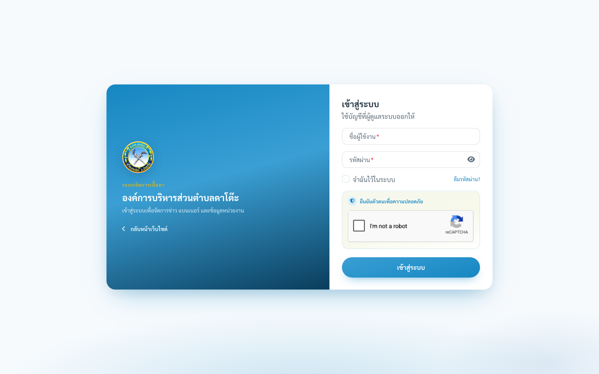

#### ขั้นตอนการปฏิบัติ:
1. เปิดเว็บบราวเซอร์ (แนะนำ Chrome, Edge หรือ Safari เวอร์ชันล่าสุด)
2. เปิด URL เข้าสู่ระบบหลังบ้านของหน่วยงาน
3. กรอก **ชื่อผู้ใช้งาน** ที่ได้รับจากผู้ดูแลระบบ
4. กรอก **รหัสผ่าน**
5. *(ถ้าใช้เครื่องส่วนตัว)* ติ๊ก **"จำฉันไว้ในระบบ"**
6. ติ๊ก **"I'm not a robot"** เพื่อยืนยันว่าไม่ใช่บอท
7. คลิก **"เข้าสู่ระบบ"**

---

### 2.2 การจัดการบัญชีผู้ใช้และการเปลี่ยนรหัสผ่าน

คลิกชื่อโปรไฟล์มุมบนขวา เพื่อเข้าเมนูส่วนตัว:

| ข้อมูลบัญชีส่วนตัว (`/auth/account`) | เปลี่ยนรหัสผ่านความปลอดภัย (`/auth/password`) |
|:---:|:---:|
| 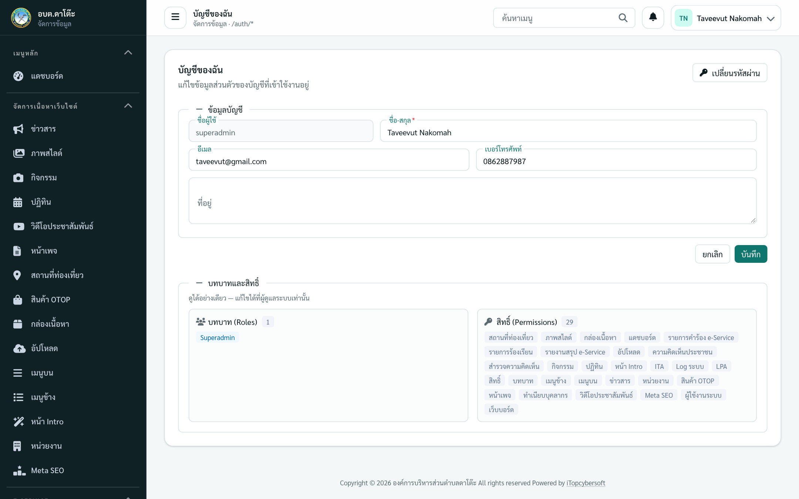 | 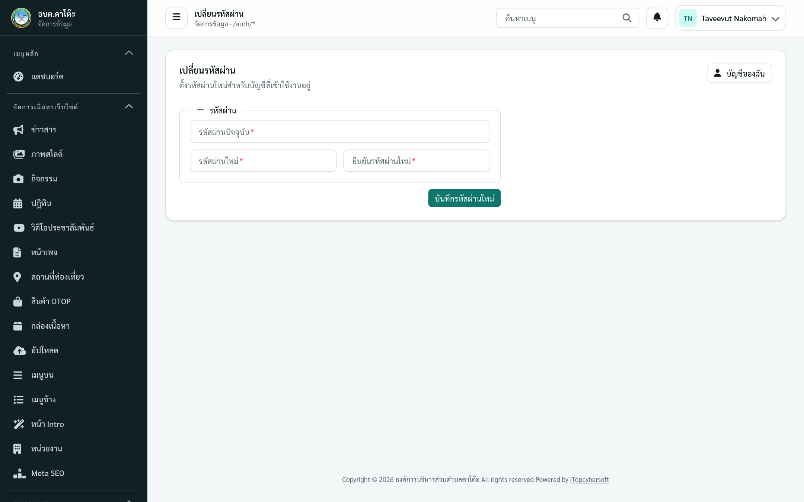 |

* **ข้อมูลบัญชี (`/auth/account`):** ดูชื่อ-นามสกุล อีเมล และชื่อบัญชี
* **เปลี่ยนรหัสผ่าน (`/auth/password`):** ใส่รหัสผ่านเดิม และรหัสผ่านใหม่ (อย่างน้อย 8 ตัวอักษร)
* **ออกจากระบบ:** คลิกชื่อบัญชีมุมบนขวา → **"ออกจากระบบ"** เพื่อปิดเซสชันและป้องกันผู้อื่นใช้ต่อ

---

## 3. ภาพรวมแดชบอร์ดหลัก (Dashboard Overview)

- **URL:** `/auth/dashboard`

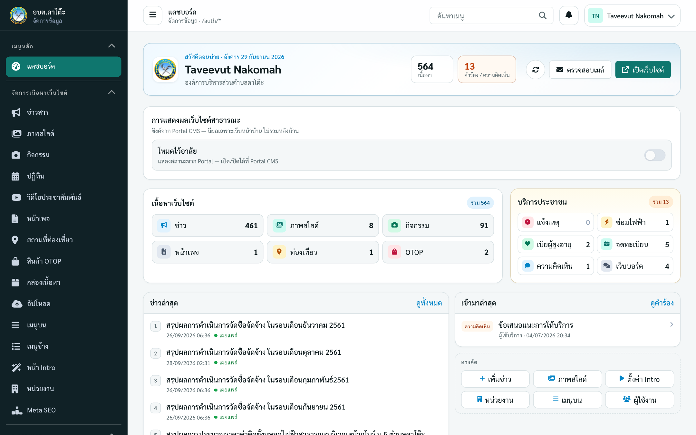

แดชบอร์ดสรุปสถานะเว็บไซต์และงานที่ต้องทำ ประกอบด้วย:

1. **แถบต้อนรับและสถิติ:** ชื่อผู้ใช้งาน จำนวนเนื้อหาทั้งหมด จำนวนคำร้อง/ความคิดเห็นที่รอตอบ และปุ่มเปิดเว็บไซต์สาธารณะ
2. **โหมดไว้อาลัย:** สวิตช์เปิด/ปิดโทนสีไว้อาลัยบนหน้าเว็บสาธารณะ
3. **การ์ดสรุปเนื้อหา:** จำนวนข่าว แบนเนอร์ ภาพกิจกรรม หน้าเพจ แหล่งท่องเที่ยว และสินค้าชุมชน
4. **การ์ด E-Service:** สถานะคำร้องตามประเภท เช่น แจ้งเหตุ ซ่อมไฟฟ้า เบี้ยผู้สูงอายุ จดทะเบียนพาณิชย์
5. **ข่าวล่าสุด:** ข่าว 5 รายการล่าสุด พร้อมสถานะ (เผยแพร่ / ฉบับร่าง)
6. **ปุ่มทางลัด:** เข้าเมนูหลักได้เร็ว เช่น เพิ่มข่าว จัดการแบนเนอร์ ตั้งค่าหน่วยงาน จัดการเมนู และผู้ใช้งาน

---

## 4. มาตรฐานการจัดการข้อมูลแบบ CRUD (Standard CRUD Operations)

ทุกเมนูใช้วิธีทำงานแบบเดียวกัน ทำให้เรียนรู้ง่าย

### 4.1 [R - Read] การเปิดดูรายการ การค้นหา และตัวกรอง
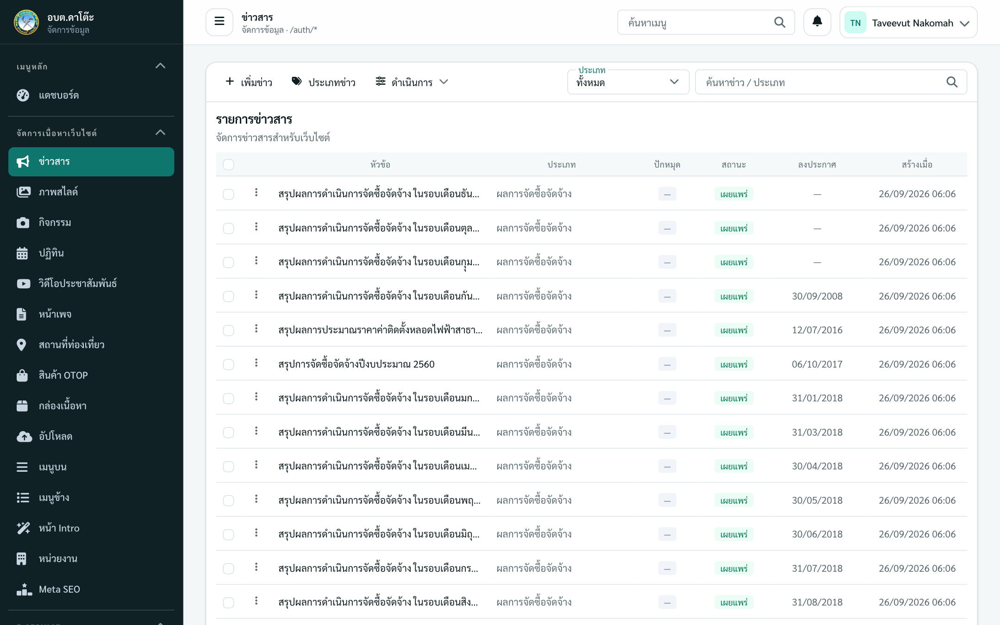

* **ค้นหา:** พิมพ์คำค้น ระบบแสดงผลทันที ไม่ต้องกด Enter
* **กรองหมวดหมู่:** เลือกจากเมนูดรอปดาวน์
* **เรียงลำดับ:** คลิกหัวตาราง (เช่น หัวข้อ วันที่) เพื่อสลับเรียงจากใหม่ไปเก่า หรือน้อยไปมาก
* **แบ่งหน้า:** เลือกแสดง 15 / 25 / 50 รายการต่อหน้า ได้ที่มุมล่างขวา

---

### 4.2 [C - Create] การเพิ่มข้อมูลใหม่
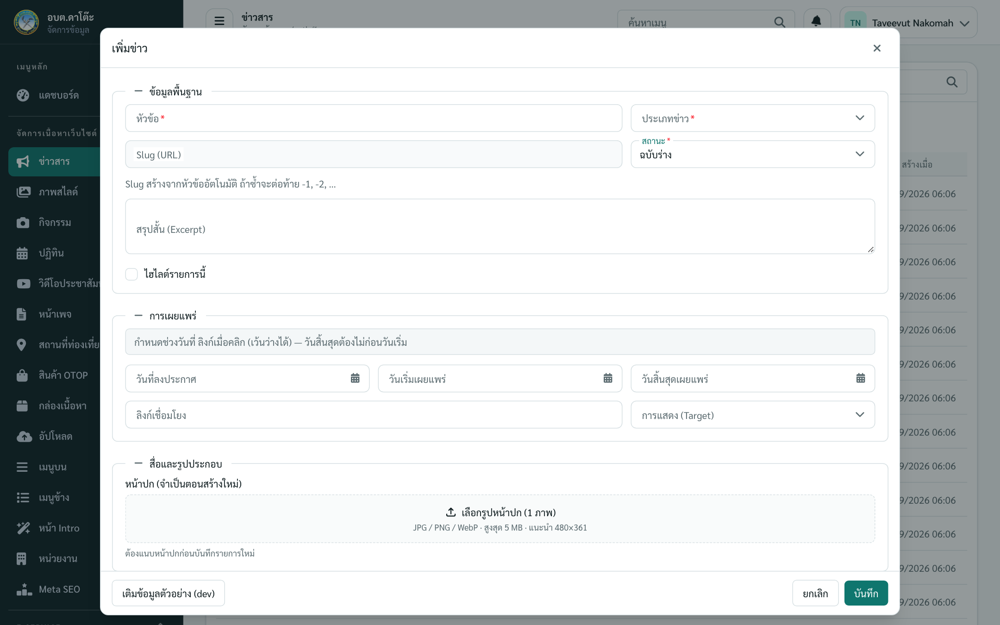

1. คลิก **"+ เพิ่ม..."** ที่แถบด้านบน (เช่น `+ เพิ่มข่าว`)
2. กรอกข้อมูลในหน้าต่างที่เปิดขึ้น:
   * **ข้อมูลพื้นฐาน:** หัวข้อ หมวดหมู่ สถานะ (ฉบับร่าง / เผยแพร่) และบทคัดย่อ
   * **การเผยแพร่:** วันที่ประกาศ วันเริ่ม/สิ้นสุดแสดงผล และลิงก์ภายนอก
   * **สื่อประกอบ:** อัปโหลดรูปปก และไฟล์แนบ (PDF, Word, Excel)
   * **เนื้อหา:** พิมพ์และจัดหน้าด้วยเครื่องมือแก้ไขข้อความ
3. คลิก **"บันทึก"** (สีเขียว) มุมล่างขวา

---

### 4.3 [U - Update] การแก้ไขข้อมูลและตัวเลือกประจำแถว
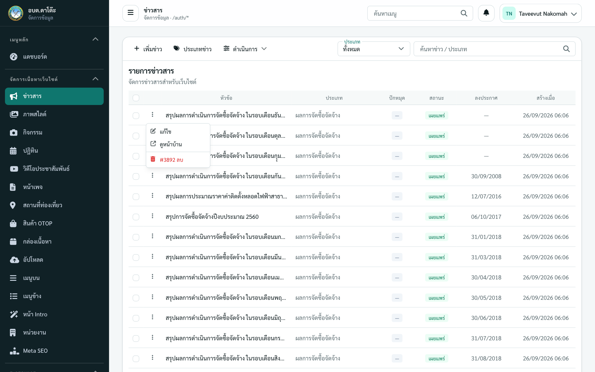

1. หาแถวที่ต้องการแก้ไข
2. คลิกปุ่ม **จุด 3 จุด (⋮)** ด้านซ้าย แล้วเลือก:
   * **แก้ไข:** แก้ข้อมูลเดิม
   * **ดูหน้าบ้าน / ดูตัวอย่าง:** เปิดดูผลจริงบนเว็บสาธารณะ
   * **ลบ:** ลบรายการนั้น

---

### 4.4 [D - Delete] การลบข้อมูลเดี่ยว และการลบแบบกลุ่ม (Bulk Actions)

| การยืนยันความปลอดภัยก่อนลบข้อมูล | การเลือกหลายรายการเพื่อจัดการพร้อมกัน (Bulk Actions) |
|:---:|:---:|
| 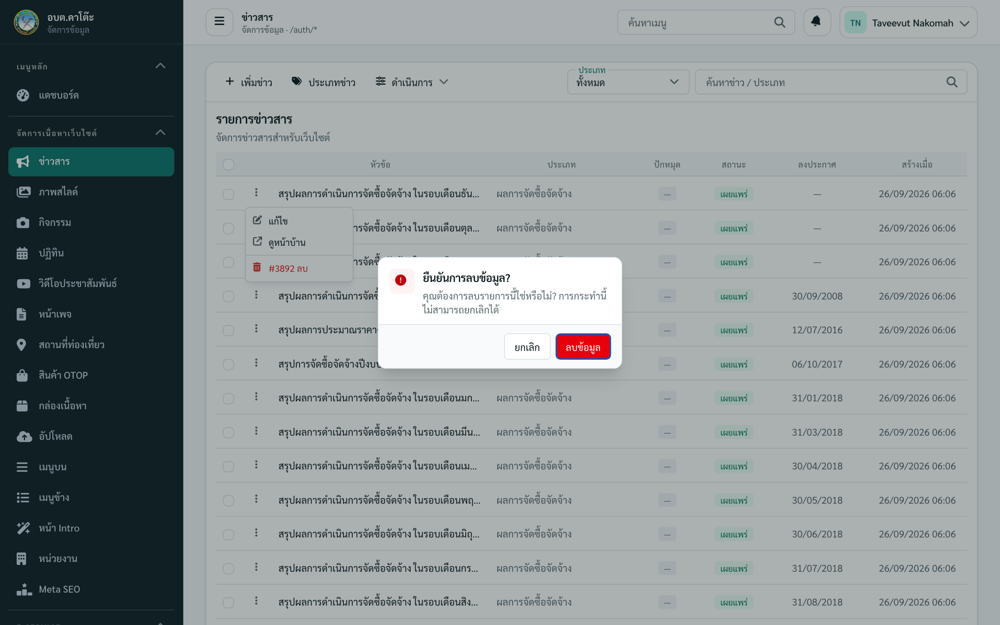 | 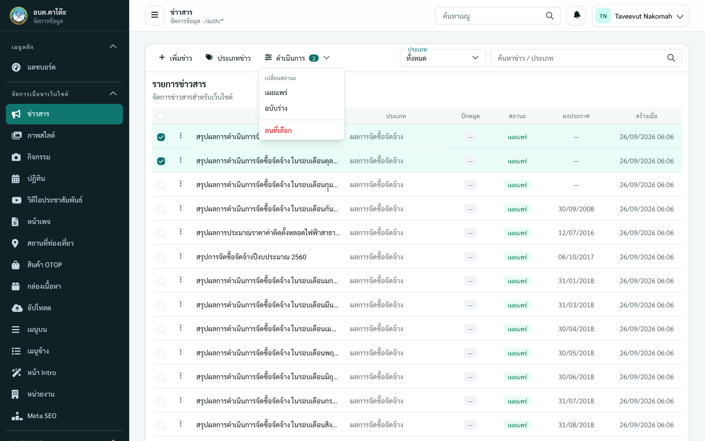 |

* **ลบทีละรายการ:**
  * คลิก **"ลบ"** ระบบจะถามยืนยันก่อนทุกครั้ง
  * ยืนยันแล้ว ข้อมูลและไฟล์ที่ผูกอยู่จะถูกลบออกทันที
* **จัดการหลายรายการพร้อมกัน:**
  1. ติ๊กเลือกรายการที่ต้องการ (หรือติ๊กช่องหัวตารางเพื่อเลือกทั้งหมดในหน้านั้น)
  2. เมนู **"ดำเนินการ (จำนวนที่เลือก)"** จะพร้อมใช้
  3. เลือกคำสั่ง:
     * **เผยแพร่:** แสดงบนเว็บพร้อมกัน
     * **ฉบับร่าง:** ซ่อนจากเว็บพร้อมกัน
     * **ลบที่เลือก:** ลบทั้งหมดที่เลือกในครั้งเดียว

---

## 5. การบริหารจัดการเนื้อหาเว็บไซต์ (Content Management Modules)

### 5.1 ข่าวสารและประกาศ (News & Announcements)
- **จัดการข่าวสาร:** `/auth/news`
- **จัดการประเภทข่าว:** `/auth/news/types`

| หน้ารายการข่าวสาร | หน้าจัดการประเภทหมวดหมู่ข่าว |
|:---:|:---:|
|  | 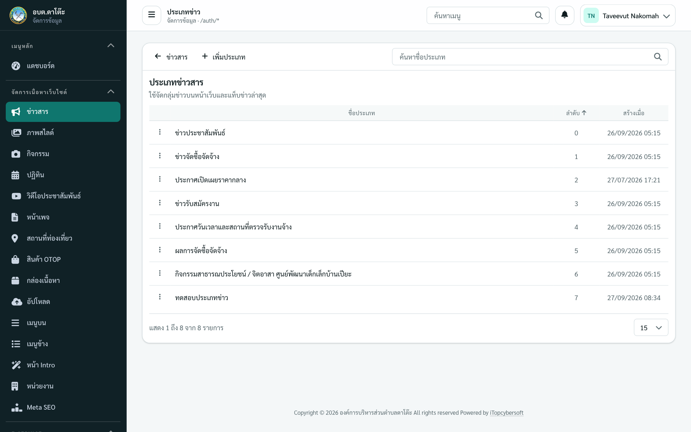 |

* **ใช้ทำอะไร:** ลงข่าวประชาสัมพันธ์ ประกาศจัดซื้อจัดจ้าง รับสมัครงาน และเอกสารข้อบัญญัติ/เทศบัญญัติ
* **วิธีใช้:**
  1. ตั้งค่าประเภทข่าวให้ครบก่อนที่หน้า **"ประเภทข่าว"**
  2. ใช้ **"ปักหมุด"** เพื่อให้ข่าวอยู่บนสุดของหน้าแรก
  3. รูปปกแนะนำสัดส่วน 4:3 (เช่น 800×600 พิกเซล)

---

### 5.2 ภาพสไลด์แบนเนอร์ประชาสัมพันธ์ (Banners)
- **URL:** `/auth/banners`

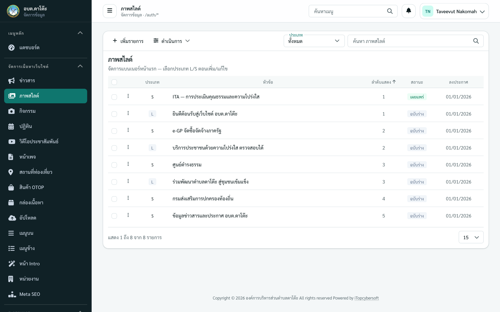

* **ใช้ทำอะไร:** จัดการภาพสไลด์ด้านบนหน้าแรก เพื่อโปรโมทโครงการหรือนโยบายสำคัญ
* **ทำได้:**
  * แบนเนอร์ขนาดใหญ่ (L) และขนาดย่อย (S)
  * กำหนดลำดับการแสดง
  * ใส่ลิงก์เมื่อประชาชนคลิกภาพ (ลิงก์ภายในหรือภายนอก)

---

### 5.3 ประมวลภาพกิจกรรม (Gallery)
- **URL:** `/auth/gallery`

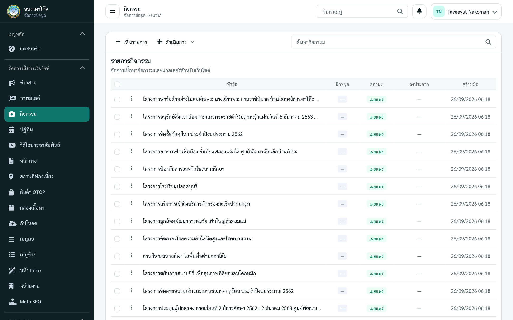

* **ใช้ทำอะไร:** ลงภาพกิจกรรม งานประเพณี การประชุม และการลงพื้นที่
* **วิธีใช้:**
  * ตั้งชื่อกิจกรรมและวันที่จัด
  * แนบรูปปกอัลบั้ม 1 ภาพ
  * อัปโหลดรูปบรรยากาศได้หลายรูปพร้อมกัน

---

### 5.4 ปฏิทินกิจกรรมและนัดหมาย (Event Calendar)
- **URL:** `/auth/gallery/calendar`

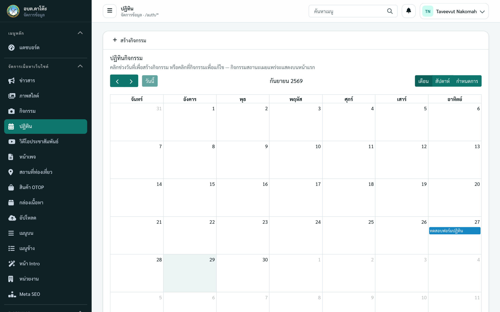

* **ใช้ทำอะไร:** แสดงนัดหมาย วันประชุม งานเทศกาล และวันหยุดราชการ
* **มุมมอง:** รายเดือน รายสัปดาห์ รายวัน หรือรายการกำหนดการ

---

### 5.5 หน้าเพจเนื้อหาคงที่ (Static Pages)
- **URL:** `/auth/pages`

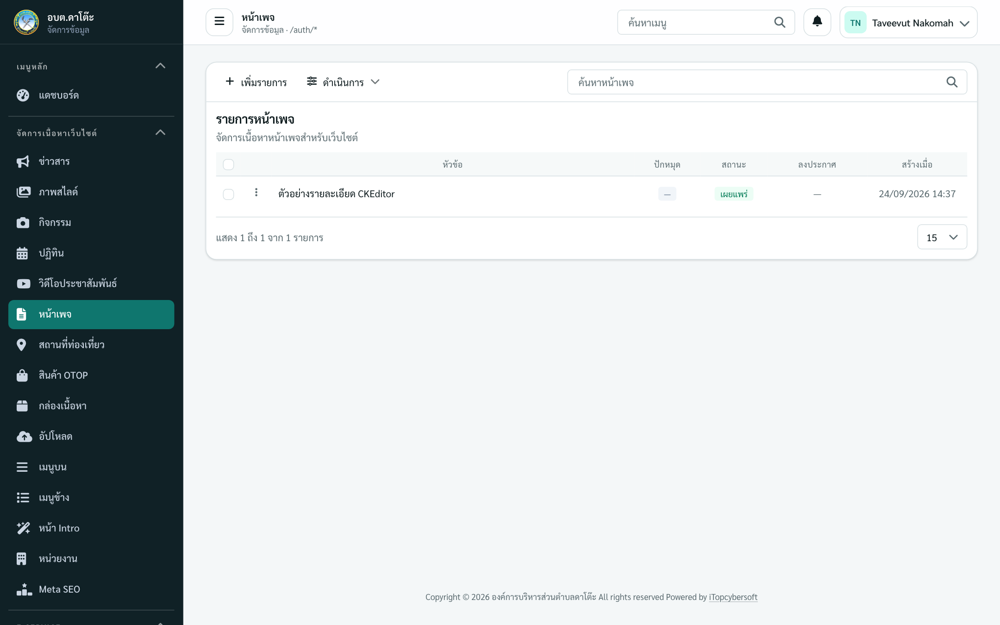

* **ใช้ทำอะไร:** จัดการหน้าเนื้อหาหลัก เช่น ประวัติ วิสัยทัศน์/พันธกิจ โครงสร้างส่วนราชการ ยุทธศาสตร์ อำนาจหน้าที่
* **การเชื่อมโยง:** แต่ละหน้ามี URL ของตัวเอง นำไปผูกกับเมนูบนหรือเมนูข้างได้เลย

---

### 5.6 ข้อมูลสถานที่และแหล่งท่องเที่ยว (Attractions & Landmarks)
- **URL:** `/auth/attractions`

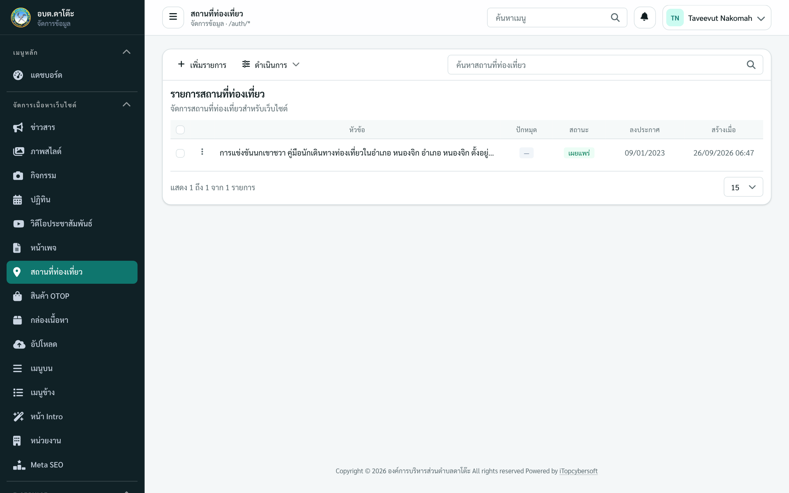

* **ใช้ทำอะไร:** แนะนำสถานที่สำคัญ จุดแลนด์มาร์ก และแหล่งท่องเที่ยวในพื้นที่
* **ข้อมูลที่ใส่ได้:** ชื่อ คำบรรยาย แกลเลอรีภาพ พิกัดแผนที่ (Google Maps) และช่องทางติดต่อ

---

### 5.7 สินค้าชุมชนและผลิตภัณฑ์ท้องถิ่น (OTOP & Local Products)
- **URL:** `/auth/otop`

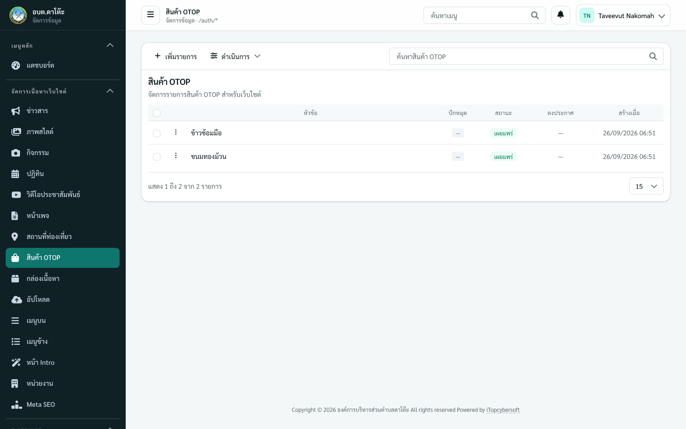

* **ใช้ทำอะไร:** แสดงสินค้าเด่นของกลุ่มแม่บ้าน วิสาหกิจชุมชน และ OTOP
* **ข้อมูลที่ใส่ได้:** ชื่อสินค้า รูปภาพ รายละเอียด ราคา กลุ่มผู้ผลิต และช่องทางสั่งซื้อ

---

### 5.8 วิดีโอสื่อประชาสัมพันธ์ (Promotional Videos)
- **URL:** `/auth/promo-videos`

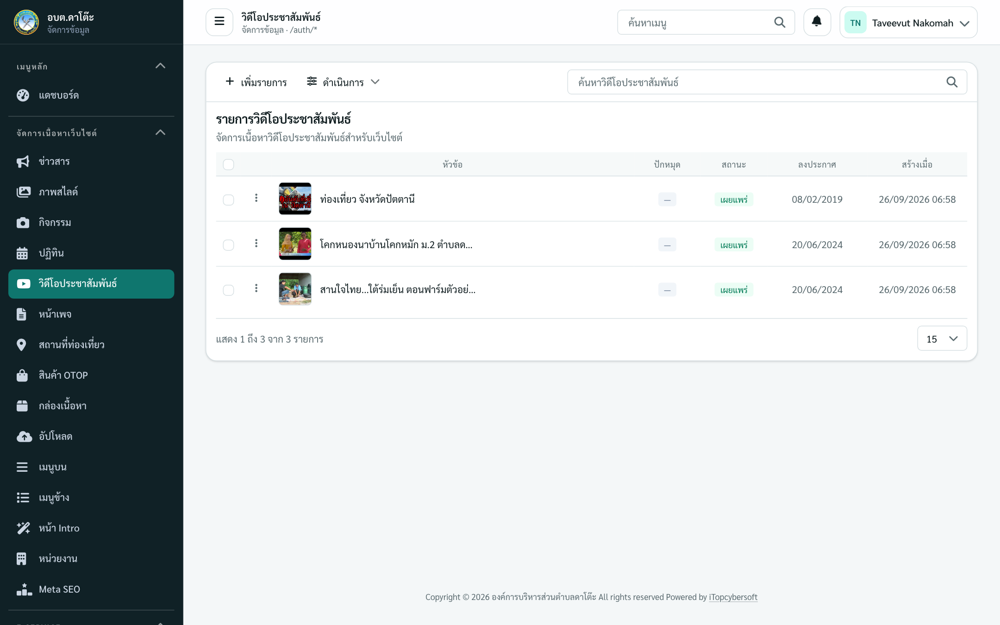

* **ใช้ทำอะไร:** เผยแพร่วิดีโอแนะนำองค์กร รายงานผลงาน หรือสารคดีชุมชน
* **วิธีใช้:** วางลิงก์หรือรหัส Embed จาก YouTube ระบบจะดึงภาพปกและสร้างเครื่องเล่นให้อัตโนมัติ

---

### 5.9 กล่องข้อความและไฮไลต์หน้าแรก (Content Box)
- **URL:** `/auth/box`

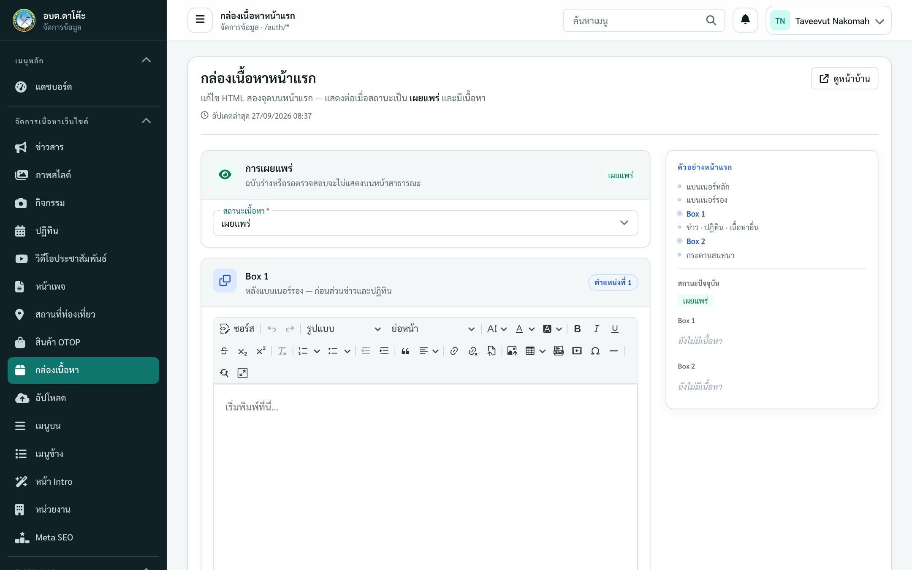

* **ใช้ทำอะไร:** จัดการพื้นที่พิเศษบนหน้าแรก เช่น สารจากผู้บริหาร คำแถลงนโยบาย หรือประกาศเร่งด่วน

---

### 5.10 ระบบจัดการคลังสื่อและไฟล์อัปโหลด (Media & File Manager)
- **URL:** `/auth/editor-uploads`

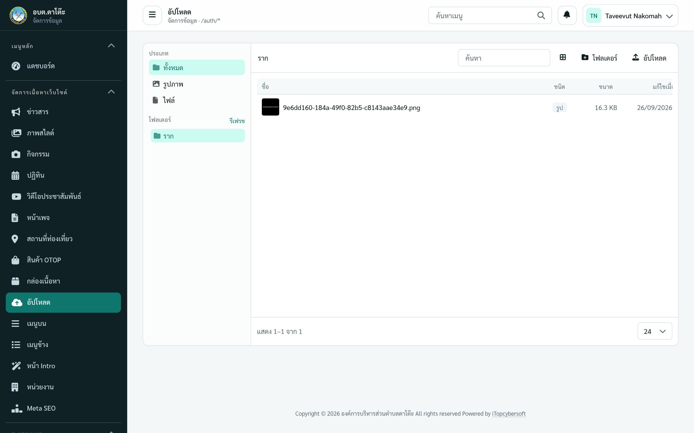

* **ใช้ทำอะไร:** เก็บไฟล์ภาพ เอกสาร PDF แผ่นพับ และสื่อดิจิทัลของหน่วยงาน
* **ทำได้:**
  * สร้างโฟลเดอร์จัดหมวดหมู่
  * อัปโหลดแบบลากวาง
  * เปลี่ยนชื่อและย้ายไฟล์ข้ามโฟลเดอร์
  * คัดลอกลิงก์ไปใช้ในบทความได้ทันที

---

### 5.11 การจัดการโครงสร้างเมนูเว็บไซต์ (Navigation Menus)
- **เมนูบน (Top Navbar):** `/auth/menu-top`
- **เมนูข้าง (Sidebar Menu):** `/auth/menu-side`

| การจัดโครงสร้างเมนูบน | การจัดโครงสร้างเมนูข้าง |
|:---:|:---:|
| 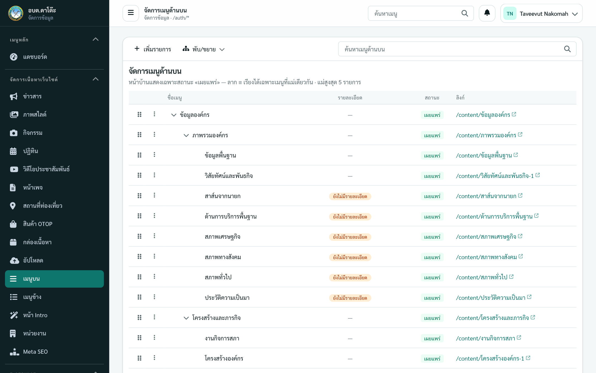 | 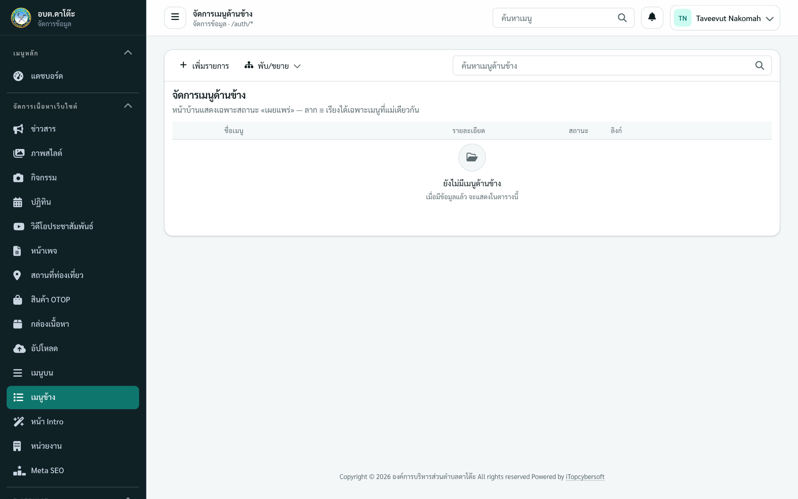 |

* **ใช้ทำอะไร:** จัดเมนูนำทางของเว็บไซต์
* **วิธีใช้:**
  * เพิ่มเมนูหลักและเมนูย่อย
  * กำหนดปลายทางเป็นลิงก์ภายในหรือภายนอก
  * จัดลำดับการแสดงได้ตามต้องการ

---

### 5.12 การตั้งค่าหน้าต้อนรับ ข้อมูลหน่วยงาน และ SEO (Site Settings)
- **หน้า Intro:** `/auth/setting/intro`
- **ข้อมูลหน่วยงาน:** `/auth/setting/org`
- **Meta SEO:** `/auth/setting/seo`

| หน้า Intro เทศกาลสำคัญ | ข้อมูลหน่วยงานและช่องทางติดต่อ | ตั้งค่า Meta SEO ค้นหา |
|:---:|:---:|:---:|
| 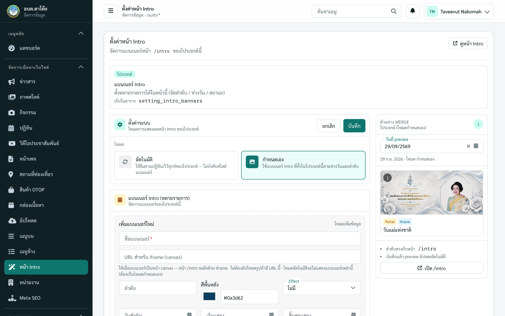 | 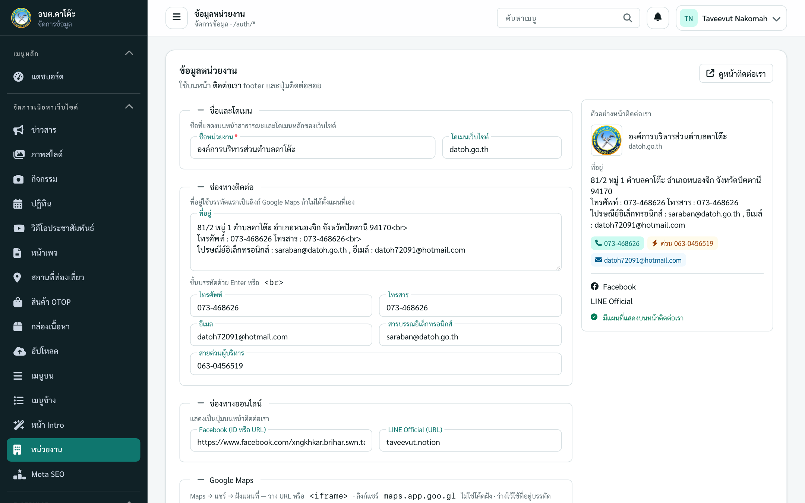 | 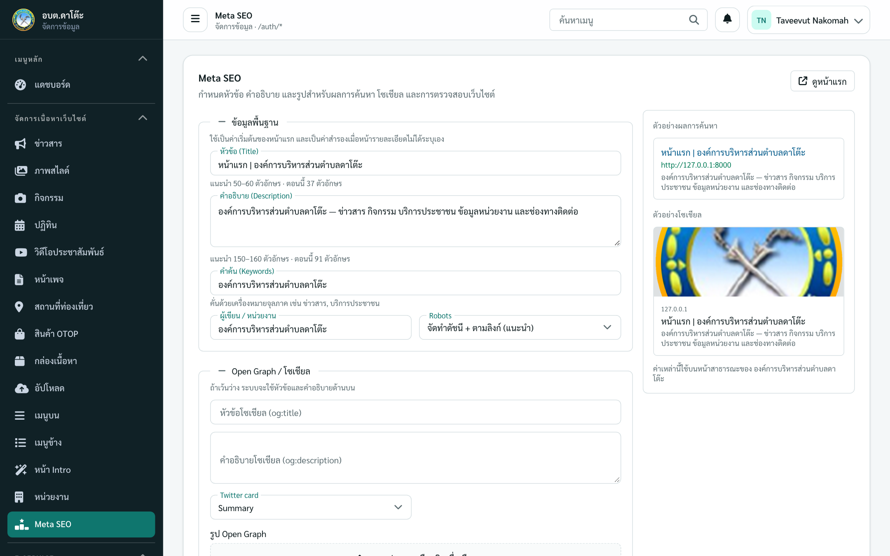 |

* **หน้า Intro:** เปิด/ปิดหน้าต้อนรับพิเศษในวันสำคัญหรือเทศกาล
* **ข้อมูลหน่วยงาน:** ตั้งชื่อหน่วยงาน โลโก้ ที่อยู่ โทรศัพท์ อีเมล แผนที่ และลิงก์โซเชียล
* **Meta SEO:** ตั้ง Title, Description, Keywords และภาพแชร์โซเชียล เพื่อให้ค้นหาเจอบน Google ได้ดีขึ้น

---

## 6. ระบบบริการประชาชนออนไลน์และการรับเรื่องร้องเรียน (E-Service & Public Engagement)

### 6.1 การจัดการคำร้องบริการออนไลน์ (E-Service Requests)
- **URL:** `/auth/e-service/services`

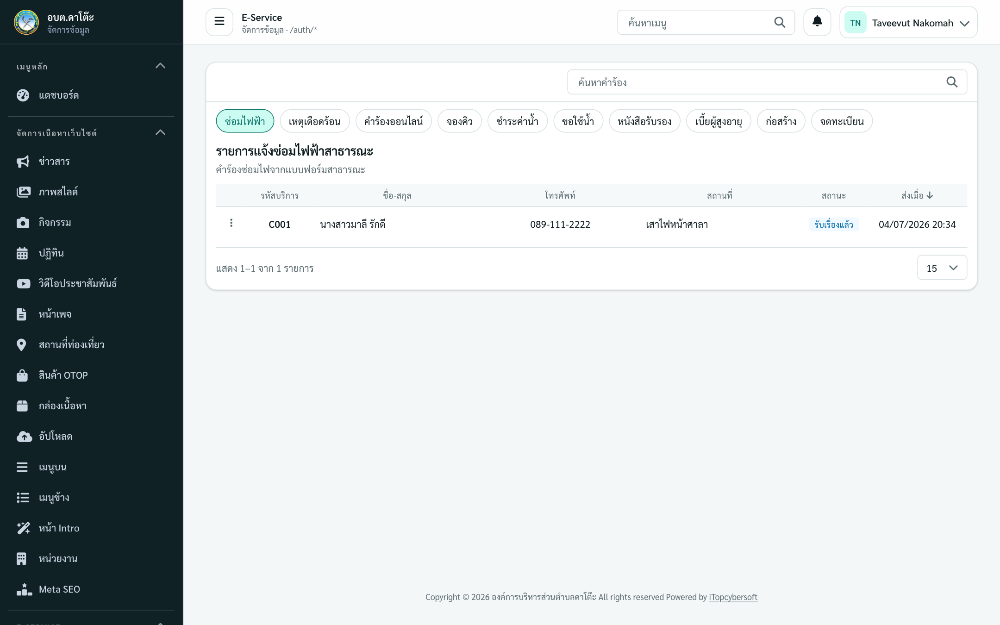

* **ใช้ทำอะไร:** รับและติดตามคำขอรับบริการออนไลน์ ตาม พ.ร.บ.การปฏิบัติราชการทางอิเล็กทรอนิกส์ พ.ศ. 2565
* **ประเภทบริการที่รองรับ:**
  1. คำร้องทั่วไป
  2. ลงทะเบียนเบี้ยยังชีพผู้สูงอายุ / คนพิการ
  3. จดทะเบียนพาณิชย์
  4. ใบอนุญาตก่อสร้าง
  5. ติดตั้ง / ซ่อมไฟฟ้าสาธารณะ
  6. ติดตั้งน้ำประปา / ชำระค่าน้ำ
  7. ขอหนังสือรับรองและเอกสารราชการ
* **ขั้นตอนของเจ้าหน้าที่:**
  * ตรวจคำร้องใหม่ที่เข้ามา
  * เปิดดูรายละเอียดและเอกสารแนบ
  * อัปเดตสถานะ: **รอดำเนินการ → กำลังดำเนินการ → อนุมัติ / เสร็จสิ้น (หรือไม่อนุมัติ)**
  * บันทึกข้อความตอบกลับ ให้ประชาชนติดตามสถานะผ่านเว็บได้

---

### 6.2 ศูนย์รับเรื่องร้องทุกข์และเรื่องร้องเรียน (Public Complaints)
- **URL:** `/auth/e-service/complaints`

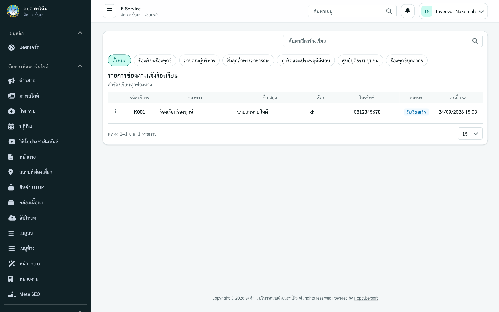

* **ใช้ทำอะไร:** รับเรื่องร้องทุกข์ ข้อเสนอแนะ และการแจ้งเบาะแสทุจริต
* **การคุ้มครองข้อมูล:**
  * แยกช่องทางร้องเรียนทั่วไป และช่องทางร้องเรียนลับ (สายตรงผู้บริหาร / ป.ป.ช. / ป.ป.ท.)
  * ข้อมูลตัวตนผู้ร้องเรียนถูกปกปิดตาม พ.ร.บ.คุ้มครองข้อมูลส่วนบุคคล (PDPA)

---

### 6.3 รายงานสรุปสถิติผลการดำเนินงาน (Service Summary Reports)
- **URL:** `/auth/e-service/summary`

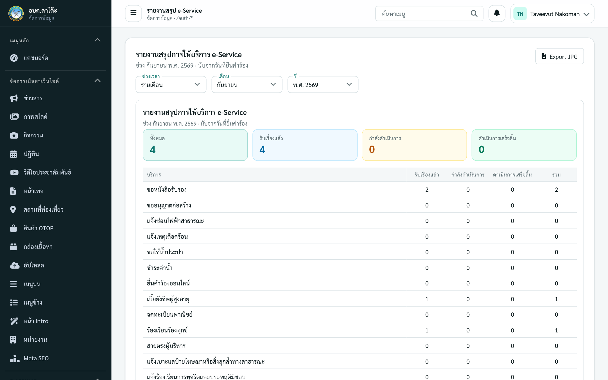

* **ใช้ทำอะไร:** ดูสถิติคำร้องแต่ละประเภท รายเดือนและรายปี สำหรับรายงานผู้บริหารและหน่วยงานกำกับดูแล

---

## 7. ข้อมูลองค์กรและการประเมินผลมาตรฐาน (Directory & Assessments)

### 7.1 ระบบความคิดเห็นและแบบสำรวจ (Citizen Feedback & Surveys)
- **ความคิดเห็นประชาชน:** `/auth/feedback`
- **สำรวจความคิดเห็น:** `/auth/feedback-surveys`

| ความคิดเห็นและข้อเสนอแนะ | แบบสำรวจความพึงพอใจ |
|:---:|:---:|
| 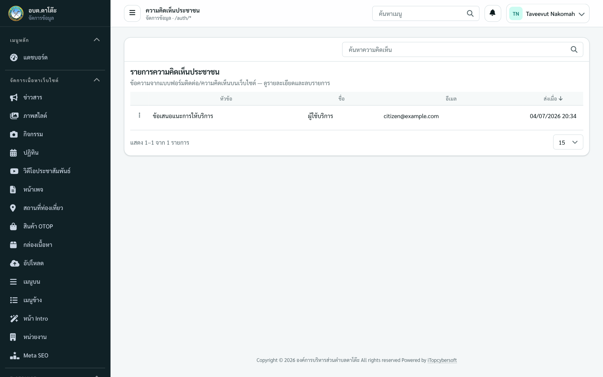 | 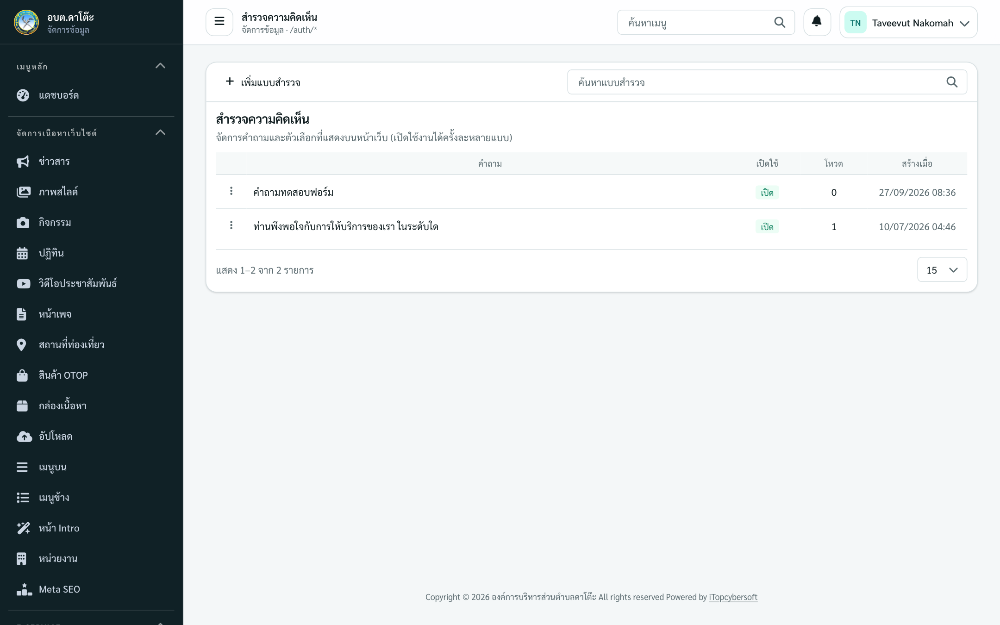 |

* **ความคิดเห็นประชาชน:** รับฟังความเห็น ประเมินความพึงพอใจ และข้อเสนอแนะ
* **แบบสำรวจ:** สร้างโพลล์หรือแบบสอบถามออนไลน์ในประเด็นสำคัญ

---

### 7.2 กระดานสนทนาสาธารณะ (Webboard)
- **URL:** `/auth/webboard`

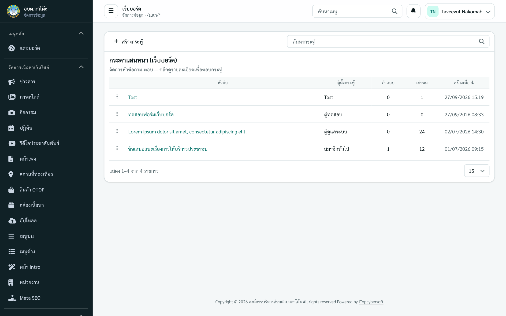

* **ใช้ทำอะไร:** ช่องทางถาม-ตอบระหว่างประชาชนกับเจ้าหน้าที่
* **การดูแล:** ตอบกระทู้ ปักหมุดกระทู้สำคัญ หรือลบข้อความไม่เหมาะสม

---

### 7.3 ทำเนียบบุคลากรและโครงสร้างองค์กร (Personnel Directory)
- **URL:** `/auth/personal`

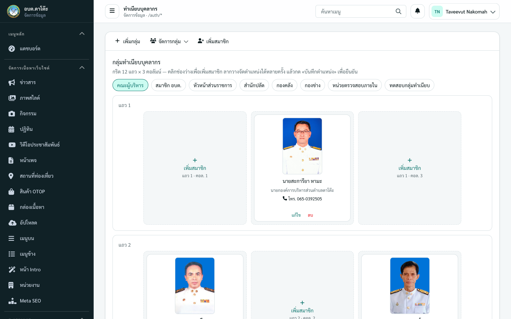

* **ใช้ทำอะไร:** แสดงผังผู้บริหาร สมาชิกสภา และบุคลากร
* **หมวดส่วนราชการ:**
  * คณะผู้บริหาร
  * สภาองค์กรปกครองส่วนท้องถิ่น
  * สำนักปลัด
  * กองคลัง
  * กองช่าง
  * กองการศึกษา ศาสนา และวัฒนธรรม
  * กองสาธารณสุขและสิ่งแวดล้อม
* **ข้อมูลบุคลากร:** ชื่อ-นามสกุล ตำแหน่ง รูปถ่าย เบอร์โทร และลำดับการแสดง

---

### 7.4 ระบบประเมินคุณธรรมและความโปร่งใส (ITA) และประสิทธิภาพ (LPA)
- **การประเมิน ITA:** `/auth/ita`
- **การประเมิน LPA:** `/auth/lpa`

| การประเมินคุณธรรมและความโปร่งใส (ITA) | การประเมินประสิทธิภาพ อปท. (LPA) |
|:---:|:---:|
| 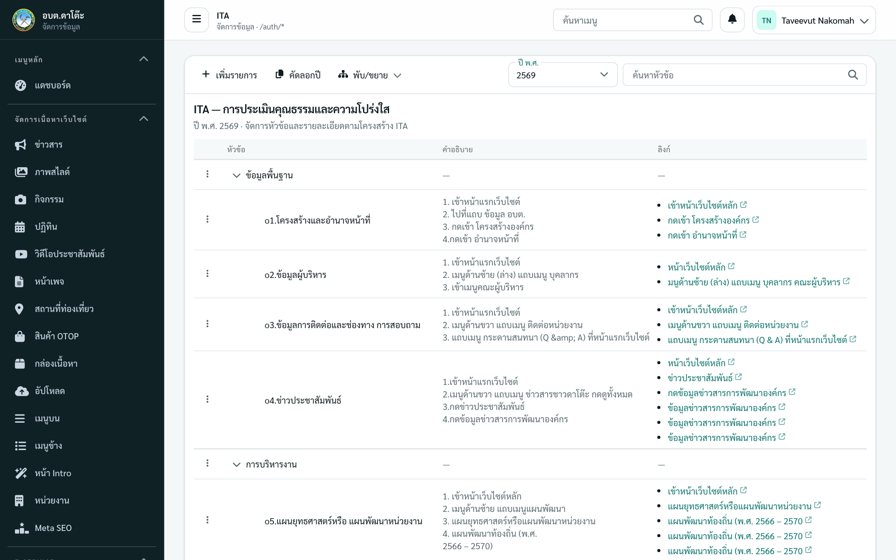 | 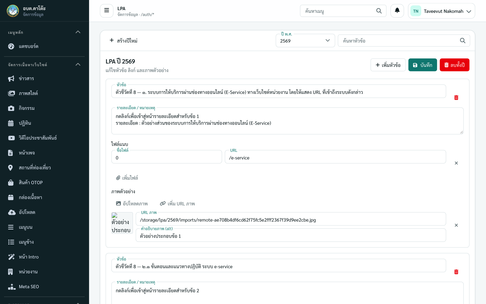 |

* **ITA:** จัดการเอกสารและลิงก์เปิดเผยข้อมูลตามเกณฑ์ ป.ป.ช. (ตัวชี้วัด O1–O43)
* **LPA:** เก็บหลักฐานประเมินประสิทธิภาพ อปท. 5 ด้าน (บริหารจัดการ งานบุคคล การเงิน การบริการสาธารณะ และธรรมาภิบาล)

---

## 8. การบริหารความปลอดภัยและสิทธิ์การเข้าถึง (Security & Administration)

### 8.1 การจัดการผู้ใช้งานระบบ (User Management)
- **URL:** `/auth/system-users`

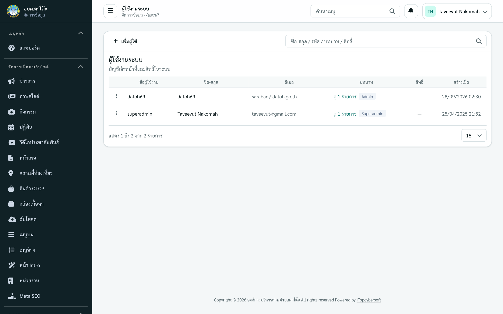

* **สร้างบัญชีใหม่:** ตั้ง Username อีเมล รหัสผ่านชั่วคราว และมอบหมายบทบาท
* **ระงับบัญชี:** เปิด/ปิดการเข้าใช้งานได้ทันที เมื่อมีการย้ายงานหรือพ้นสภาพ

---

### 8.2 บทบาทและสิทธิ์การใช้งาน (Roles & Permissions)
- **บทบาท (Roles):** `/auth/master/roles`
- **สิทธิ์ (Permissions):** `/auth/master/permissions`

| การกำหนดบทบาท (Roles) | การกำหนดสิทธิ์การเข้าถึง (Permissions) |
|:---:|:---:|
| 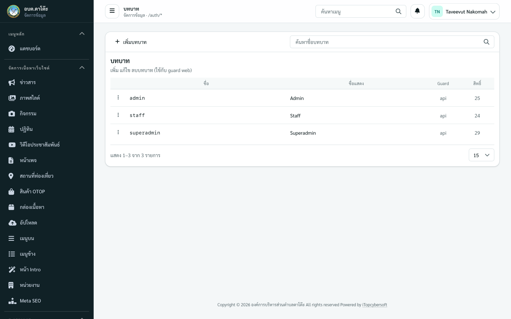 | 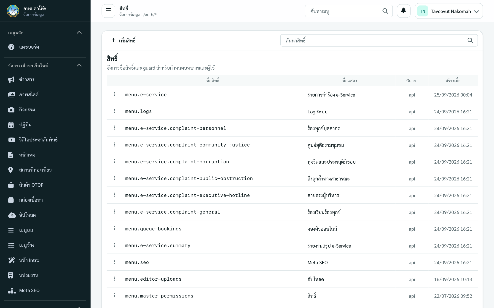 |

* **บทบาท:** จัดกลุ่มผู้ใช้ตามหน้าที่ เช่น ผู้ดูแลระบบสูงสุด เจ้าหน้าที่ประชาสัมพันธ์ เจ้าหน้าที่ทะเบียน เจ้าหน้าที่รับเรื่องร้องเรียน
* **สิทธิ์:** กำหนดละเอียดต่อโมดูล เช่น ดูอย่างเดียว สร้าง/แก้ไขได้ หรือลบได้

---

### 8.3 บันทึกประวัติและตรวจสอบการใช้งาน (Audit Logs)
- **URL:** `/auth/logs`

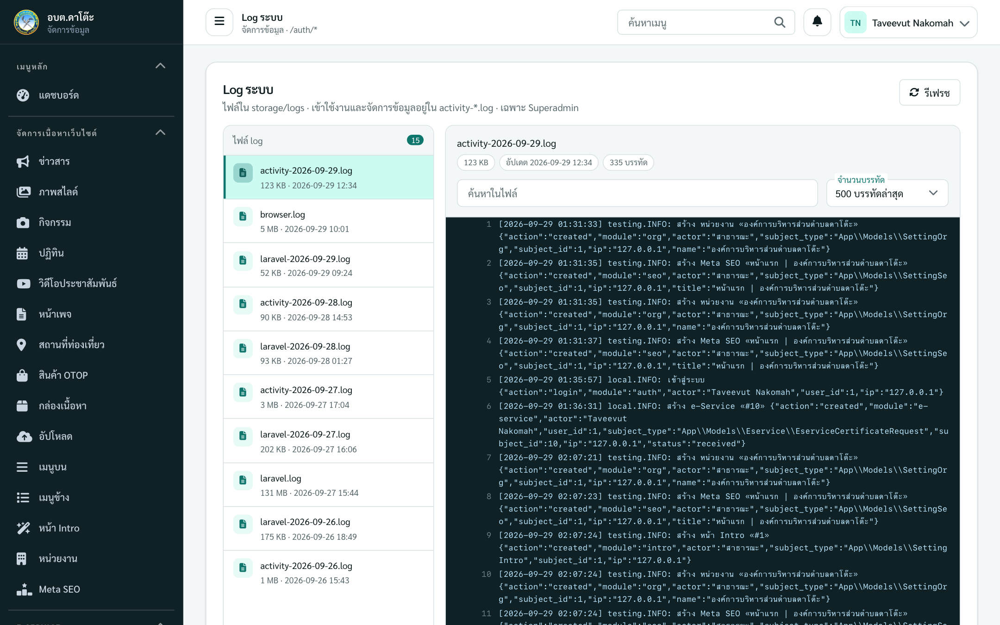

* **ใช้ทำอะไร:** เก็บหลักฐานการใช้งานระบบ ตาม พ.ร.บ.คอมพิวเตอร์
* **ข้อมูลที่บันทึก:** วันเวลา ผู้ใช้ กิจกรรม (สร้าง/แก้ไข/ลบ/ล็อกอิน) โมดูล และ IP Address

---

## 9. ข้อแนะนำและมาตรฐานความปลอดภัย (Best Practices)

1. **บันทึกทุกครั้ง:** กรอกฟอร์มเสร็จแล้วกด **"บันทึก"** (สีเขียว) เสมอ หากไม่ต้องการบันทึก กด **"ยกเลิก"** หรือกากบาท
2. **ขนาดรูปภาพแนะนำ:**
   * แบนเนอร์หน้าแรก: 1920 × 1080 พิกเซล
   * ปกข่าว/กิจกรรม: 800 × 600 พิกเซล (สัดส่วน 4:3)
   * ขนาดไฟล์ไม่เกิน 2–5 MB ต่อภาพ เพื่อให้เว็บโหลดเร็ว
3. **ใช้สถานะ "ฉบับร่าง":** ถ้ายังเขียนไม่เสร็จ ให้เลือก **"ฉบับร่าง"** จะไม่แสดงต่อสาธารณะ จนกว่าจะเปลี่ยนเป็น **"เผยแพร่"**
4. **รักษาความปลอดภัยบัญชี:**
   * อย่าใช้รหัสผ่านง่าย ๆ เช่น วันเกิด หรือ 123456
   * เปลี่ยนรหัสผ่านทุก 3–6 เดือน
   * อย่าแชร์รหัสผ่านกับผู้อื่น
   * กด **"ออกจากระบบ"** ทุกครั้งหลังใช้งาน โดยเฉพาะเครื่องส่วนกลาง
